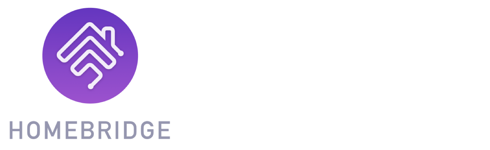
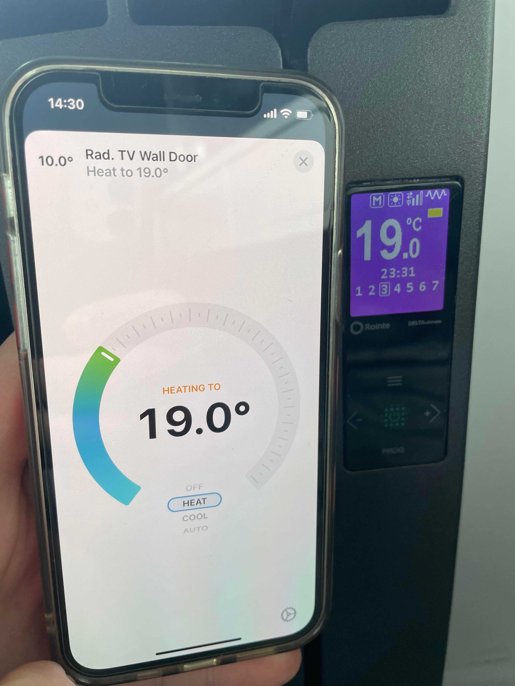
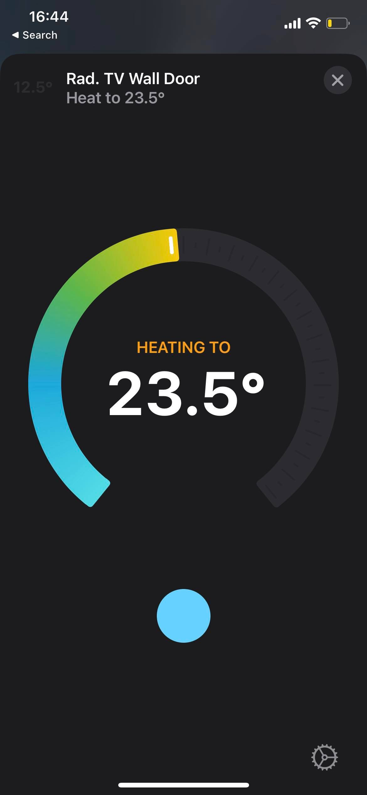

# @jwcnewton/homebridge-rointe-unofficial 

This plugin exposes Rointe installations to <a href="https://homebridge.io">Homebridge</a>, this is developed and maintained in my free time to learn typescript. 

## Configuration

Key | Example | Description
---------|----------|---------
 username | test@test.test | The username used to register on the Rointe App usually an email address.
 password | test | The password used to register on the Rointe App.
 installation_name | Home | The installation_name setup via the Rointe app
 updateInterval | 15 | The interval to get updates at (seconds).

## Development

Setup homebridge locally [here](https://github.com/homebridge/homebridge#plugin-development) then run `npm run debug` 

  
&nbsp; &nbsp; &nbsp; &nbsp;
  

## Note
 - Please raise bugs with as much details as possible 
 - Currently this only works with a single Rointe installation 
 - UI Features can be added but anything outside of the standard thermostat - *raise a bug in*: [rointe-sdk-node](https://github.com/jwcnewton/rointe-sdk-node)

## 